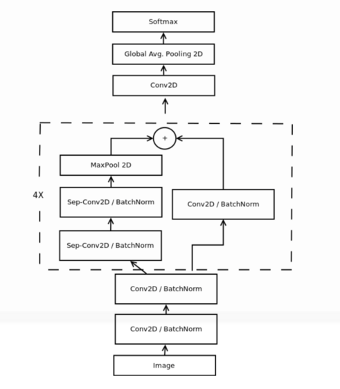

# Emotion Recognition

This is an emotion recognition algorithm that can detect 7 different emotion with around 70% accuracy.

## Requirements

> **Use Google Colab to run the model**

> [Dataset](https://www.kaggle.com/c/challenges-in-representation-learning-facial-expression-recognition-challenge/data)

> OpenCV

> Keras

> Numpy

> Matplotlib

> Pandas

> scikit-learn

## Google Colab link

https://colab.research.google.com/drive/1UMxztANywY7wl41J-em_YSlCPl56aWaR

## Instructions

### Model

  You can use the pre-trained model from this repository(recog.h5) or you can train your own model.
  You are free to mess with the parameters of the neural network model.

  Install all the require packages and run the **main.py** file.
